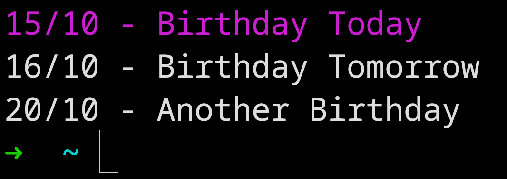

# birthday-tracker-cli

  

## Installation

- `sudo chmod +x install.sh`
- `./install.sh`

## Use

- `-c`: Create the database (*will delete the old one*).
- `-a` \[name] \[surname] \[day] \[month] \[year]: Creates a new birthday and stores it in the database.
- `_`: Fetch the database and print the birthdays for the next week.
